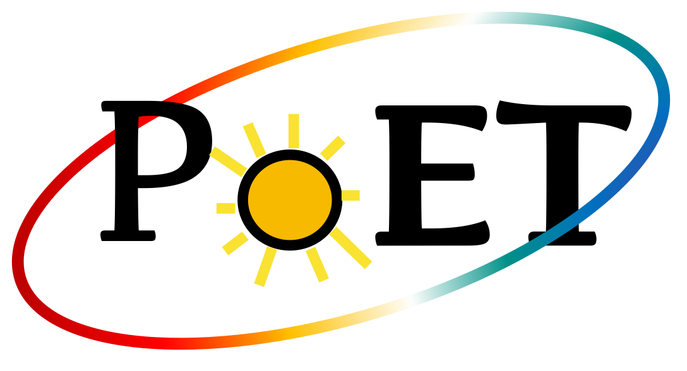

# Acknowledgements

If you are using SOAP in its latest version, please cite the following papers:

```bibtex
@ARTICLE{2025A&A...702A..84C,
       author = {{Cristo}, E. and {Faria}, J.~P. and {Santos}, N.~C. and {Dethier}, W. and {Akinsanmi}, B. and {Barka}, A. and {Demangeon}, O. and {Lucero}, J.~P. and {Silva}, A.~M.},
        title = "{SOAPv4: A new step toward modeling stellar signatures in exoplanet research}",
      journal = {\aap},
     keywords = {planets and satellites: atmospheres, stars: atmospheres, planetary systems, Earth and Planetary Astrophysics, Solar and Stellar Astrophysics},
         year = 2025,
        month = oct,
       volume = {702},
          eid = {A84},
        pages = {A84},
          doi = {10.1051/0004-6361/202555184},
archivePrefix = {arXiv},
       eprint = {2510.08319},
 primaryClass = {astro-ph.EP},
       adsurl = {https://ui.adsabs.harvard.edu/abs/2025A&A...702A..84C},
      adsnote = {Provided by the SAO/NASA Astrophysics Data System}
}

@ARTICLE{2012A&A...545A.109B,
       author = {{Boisse}, I. and {Bonfils}, X. and {Santos}, N.~C.},
        title = "{SOAP. A tool for the fast computation of photometry and radial velocity induced by stellar spots}",
      journal = {\aap},
     keywords = {methods: numerical, planetary systems, techniques: radial velocities, techniques: photometric, stars: activity, starspots, Astrophysics - Instrumentation and Methods for Astrophysics, Astrophysics - Earth and Planetary Astrophysics, Astrophysics - Solar and Stellar Astrophysics},
         year = 2012,
        month = sep,
       volume = {545},
          eid = {A109},
        pages = {A109},
          doi = {10.1051/0004-6361/201219115},
archivePrefix = {arXiv},
       eprint = {1206.5493},
 primaryClass = {astro-ph.IM},
       adsurl = {https://ui.adsabs.harvard.edu/abs/2012A&A...545A.109B},
      adsnote = {Provided by the SAO/NASA Astrophysics Data System}
}
```

## Funding
This project is funded by the European Union (ERC, FIERCE, 101052347)


<div style="display: flex; flex-wrap: wrap; justify-content: center; place-items: center; gap: 30px; padding: 20px 0; width: 100%;">
  
  
  
</div>