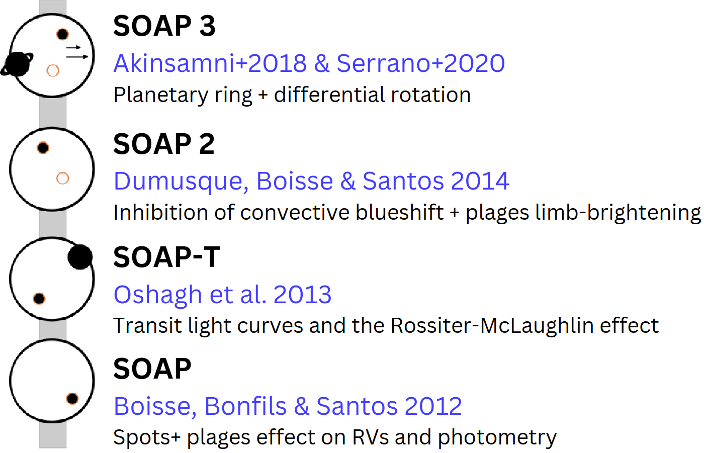

# Welcome to SOAP's Documentation!

## Introduction

**SOAPv4** (*Spot Oscillation And Planet*) is an open-source Python package designed to model the impact of stellar activity and planetary transits on high-resolution spectroscopic, radial velocity and photometric observations.  

In the era of high-resolution spectroscopy, understanding how stellar features - such as spots and facula observables is essential for the accurate characterization of exoplanets and their atmospheres.

Initially developed to simulate the radial velocity effects of stellar spots, SOAP has evolved over several versions to incorporate a wide range of physical phenomena and observing configurations. With SOAPv4, users can directly simulate both cross-correlation functions and full stellar spectra, modeling the impact of active regions, differential rotation, convective blueshift, and planet-induced line profile distortions.

---

## Some of the use cases of SOAP

SOAPv4 is especially suited for researchers who want to:
- Compute time series of integrated stellar spectra
- Assess stellar contamination in exoplanet transit spectra
- Comput the photometric and radial velocity modulation of stellar activity
- Model the signal of transiting planets for a wide range of stellar/planetary system parameters  
- Model transmission spectra (POLDs) and Doppler shadow in a simple way
---

## Development of SOAP through Time  

The **SOAP code** ([*Boisse et al. 2012*](https://ui.adsabs.harvard.edu/#abs/2012A%26A...545A.109B)) was originally developed to model the impact of stellar activity, particularly starspots, on radial velocity (RV) time series. In its first implementation, SOAP approximated the local stellar disk spectrum using cross-correlation functions (CCFs), represented as Gaussian profiles with user-defined parameters. For each stellar surface element, the corresponding CCF was Doppler-shifted according to local rotational velocities under the assumption of solid-body rotation, and flux-weighted according to a limb-darkening law.  

Active regions (ARs) were introduced as circular areas, initially placed at the stellar disk center and then mapped to the appropriate latitude and longitude using spherical symmetry. The same Gaussian profile was applied to the ARs’ CCFs, with their contribution scaled by a contrast parameter: values between 0 and 1 for dark spots, and values above 1 for bright faculae. Although simplistic, this framework introduced a first-order tool for quantifying the distortions introduced by stellar activity into RV measurements.  

Building on this foundation, several successive versions expanded SOAP’s scope:  

- **SOAP-T** ([*Oshagh et al. 2013*](https://ui.adsabs.harvard.edu/abs/2013A&A...556A..19O)) incorporated transiting exoplanets. The code simulates the occultation of quiet-star (QS) pixels by subtracting their contribution during the transit, enabling simultaneous modeling of photometric light curves, Keplerian motion, and the *Rossiter–McLaughlin effect* (Holt 1893; Rossiter 1924; McLaughlin 1924). This made SOAP-T a practical tool for probing spin–orbit alignments in planetary systems.  

- **SOAP 2.0** ([*Dumusque et al. 2014*](https://ui.adsabs.harvard.edu/abs/2014ApJ...796..132D)) improved the physical realism of the stellar activity modeling by grounding simulations in *solar observations*. High-resolution data from the Kitt Peak Fourier Transform Spectrograph (FTS), including spectra of quiet-sun (QS) regions (*Wallace et al. 1998*) and sunspot umbrae (*Wallace et al. 2005*), were incorporated. This allowed more realistic modeling of stellar line-profile deformations, particularly the effects of *convective blueshift* and its inhibition inside ARs. SOAP 2.0 also introduced facular limb brightening and spot/faculae contrasts determined via the Planck function across temperature differences. Despite these refinements, it still remained limited to synthetic CCFs rather than full spectra.  

Although not fully released to the public, intermediate versions significantly shaped later developments:  

- [**Oshagh et al. (2016)**](https://ui.adsabs.harvard.edu/abs/2016A%26A...593A..25O) integrated upgrades from SOAP-T and SOAP 2.0 to investigate how stellar activity biases measurements of planetary spin–orbit misalignments.  
- [**Akinsanmi et al. (2018)**](https://ui.adsabs.harvard.edu/abs/2018A%26A...609A..21A/abstract) implemented extensions to simulate ringed planets and stellar rotational deformation, capturing their signatures in both photometric light curves and RVs during the Rossiter–McLaughlin effect.  
- [**Serrano et al. (2020)**](https://ui.adsabs.harvard.edu/abs/2020MNRAS.493.5928S/abstract) and **Cristo et al. (2024)** added differential rotation (e.g., *Balona & Abedigamba 2016*) and activity-related convective blueshift signals during planetary transits (*Shporer & Brown 2011*). These additions pushed SOAP toward modeling stellar activity at a higher level of physical detail.  

A parallel branch was developed in the form of **SOAP-GPU** ([*Zhao & Dumusque 2023*](https://ui.adsabs.harvard.edu/abs/2023A%26A...671A..11Z)), a fork of SOAP 2.0 aimed at simulating stellar spectra instead of CCFs. SOAP-GPU introduced direct mapping of ARs, more sophisticated treatments of convective blueshift across the stellar disk based on empirical solar measurements (*Löhner-Böttcher et al. 2019*), and GPU optimization for improved computational efficiency. Nevertheless, its reliance on GPU architectures reduced accessibility for many users, and it did not support planetary transits.  

These various implementations ultimately converged in **SOAPv4**, the latest version of the code. By integrating the advances of all previous versions and extending beyond CCF-only output, SOAPv4 now produces *time-resolved stellar spectra as well as CCFs*. This marks a critical step in evolving SOAP from a specialized RV simulator into a comprehensive framework for modeling spectra, transit signals, stellar variability, and their interplay in exoplanetary science.  

## Getting Started

SOAPv4 is publicly available on GitHub:  
[https://github.com/EduardoCristo/SOAP-Spot-Oscillation-And-Planet-code](https://github.com/EduardoCristo/SOAP-Spot-Oscillation-And-Planet-code)

For detailed installation and usage instructions, see the [Install Guide](install.md).

---

## SOAP History

---